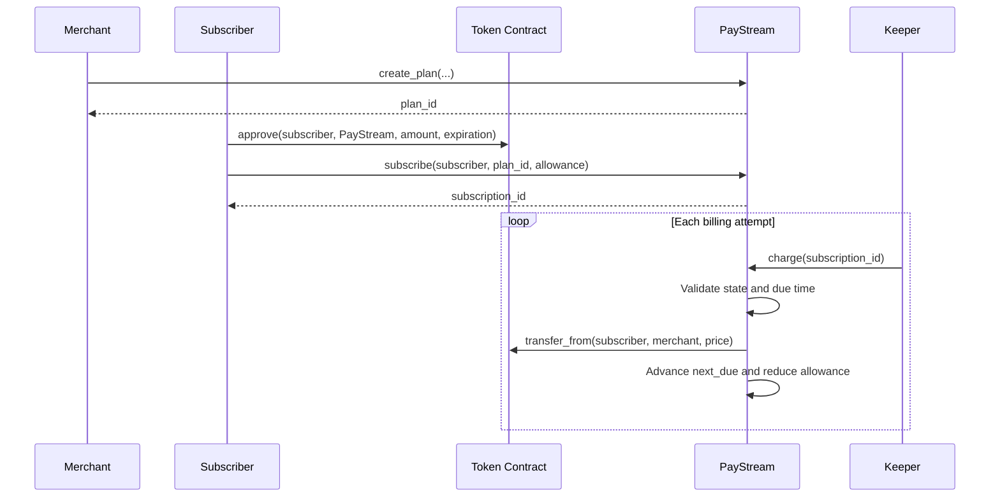

# PayStream Architecture

## Overview

PayStream is a non-custodial recurring subscription billing protocol implemented as a Soroban smart contract on the Stellar blockchain.

Merchants create recurring payment plans, subscribers authorize token spending and create subscriptions, and an off-chain keeper periodically attempts to collect payments that are due. PayStream never takes custody of subscriber funds: tokens remain in the subscriber's account until the contract executes an authorized `transfer_from` payment to the merchant.

## Testnet Deployment

| Component | Address |
| --- | --- |
| PayStream contract | `CAGPAEHIEP7TOREAANS6CTYACQ6MCNVTKTBOQZIRFP3DVL3PC3DODSPJ` |
| Native XLM Stellar Asset Contract | `CDLZFC3SYJYDZT7K67VZ75HPJVIEUVNIXF47ZG2FB2RMQQVU2HHGCYSC` |

These are testnet addresses and must not be treated as mainnet deployments.

## Components

PayStream consists of:

1. The Soroban contract, which stores plans and subscriptions and enforces billing rules.
2. Soroban token contracts, which hold subscriber balances and allowances.
3. The Node.js keeper, which invokes `charge` for configured subscription IDs.

The keeper pays transaction fees and triggers the permissionless `charge` function. It does not hold subscriber funds or receive direct permission to spend them.

## Version 1 Billing Scope

PayStream v1 intentionally implements flat recurring billing: every plan has a fixed token price and a fixed interval in seconds. Each successful charge transfers that fixed price and advances the subscription by one interval.

Usage-based or metered billing is deferred to v2. Supporting it safely will require additional usage-recording, authorization, validation, and dispute assumptions that are outside the deliberately narrow v1 protocol.

## Payment Flow



## Storage Model

PayStream uses Soroban persistent contract storage. The current implementation does not explicitly extend storage time-to-live.

### Storage Keys

```rust
#[contracttype]
pub enum DataKey {
    Plan(u64),
    Subscription(u64),
    NextPlanId,
    NextSubId,
}
```

| Key | Value | Purpose |
| --- | --- | --- |
| `DataKey::Plan(plan_id)` | `Plan` | Stores a plan by numeric ID. |
| `DataKey::Subscription(subscription_id)` | `Subscription` | Stores a subscription by numeric ID. |
| `DataKey::NextPlanId` | `u64` | Stores the next plan ID to allocate. |
| `DataKey::NextSubId` | `u64` | Stores the next subscription ID to allocate. |

Both counters default to `0` when absent and are incremented after an ID is allocated.

### Plan

```rust
#[contracttype]
#[derive(Clone)]
pub struct Plan {
    pub merchant: Address,
    pub price: i128,
    pub interval_seconds: u64,
    pub token: Address,
    pub active: bool,
}
```

- `merchant` receives each payment.
- `price` is the token amount charged per billing cycle.
- `interval_seconds` is the time between scheduled payments.
- `token` identifies the Soroban token contract used for payment.
- `active` controls whether new subscriptions may be created.

Plans are stored as `DataKey::Plan(plan_id) -> Plan`. Every new plan is currently active, and the contract does not yet expose a plan-deactivation function.

### Subscription

```rust
#[contracttype]
#[derive(Clone)]
pub struct Subscription {
    pub subscriber: Address,
    pub plan_id: u64,
    pub next_due: u64,
    pub status: SubStatus,
    pub allowance_remaining: i128,
}
```

- `subscriber` is the address whose balance is charged.
- `plan_id` links the subscription to its plan.
- `next_due` is the ledger timestamp at which the next charge becomes eligible.
- `status` is either `Active` or `Cancelled`.
- `allowance_remaining` is PayStream's internal spending limit for the subscription.

Subscriptions are stored as `DataKey::Subscription(subscription_id) -> Subscription`.

The internal `allowance_remaining` does not replace the allowance recorded by the token contract. A payment requires both values to be sufficient.

## Contract Interface

The contract exposes six public functions: two read-only functions and four state-changing functions.

### `get_plan`

Returns the plan stored under a supplied ID. It returns `PlanNotFound` when the ID does not exist. No authorization is required.

### `get_subscription`

Returns the subscription stored under a supplied ID. It returns `SubscriptionNotFound` when the ID does not exist. No authorization is required.

### `create_plan`

1. Requires authorization from `merchant`.
2. Reads `NextPlanId`, defaulting to `0`.
3. Creates an active plan with the supplied price, interval, and token.
4. Stores the plan under its allocated ID.
5. Increments `NextPlanId`.
6. Returns the plan ID.

The current implementation does not validate that the price and interval are positive and does not restrict token addresses.

### `subscribe`

1. Requires authorization from `subscriber`.
2. Loads the requested plan.
3. Rejects a missing or inactive plan.
4. Reads `NextSubId`, defaulting to `0`.
5. Sets `next_due` to the current ledger timestamp plus the plan interval.
6. Creates and stores an active subscription.
7. Increments `NextSubId`.
8. Returns the subscription ID.

The current implementation permits multiple subscriptions from one subscriber to the same plan. It also stores zero or negative internal allowance values, although these cannot fund a positive-price charge.

### `charge`

`charge` is permissionless so any caller may trigger a payment that the subscriber has already authorized.

1. Loads the subscription and verifies that it is active.
2. Verifies that the current timestamp is at least `next_due`.
3. Loads the associated plan.
4. Verifies that `allowance_remaining` covers the plan price.
5. Calls the plan token's `transfer_from`, with PayStream as spender, to transfer the price from subscriber to merchant.
6. Advances `next_due` by one interval.
7. Reduces `allowance_remaining` by the plan price.
8. Stores the updated subscription.

The token contract independently validates its real allowance, allowance expiration, balance, and other token rules. If `transfer_from` fails, the invocation fails and the later storage changes are not committed.

Advancing the previous due time by one interval preserves the original schedule. A subscription that is several intervals overdue may require repeated successful calls to catch up.

### `cancel`

1. Loads the subscription.
2. Requires authorization from its stored subscriber.
3. changes its status to `Cancelled`.
4. Stores the updated subscription.

Cancellation prevents future PayStream charges but does not revoke the token-contract allowance. The subscriber may separately reduce or revoke that allowance through the token contract.

## Authorization and Token Approval

The subscriber must call the token contract's `approve` function directly before calling `subscribe`. The spender supplied to `approve` must be the PayStream contract address.

`subscribe` must not call `token.approve` internally. A previous nested-authorization design caused persistent `HostError: Error(Contract, #9)` failures and required redeployment, so approval and subscription are deliberately separate transactions.

The required order is:

1. The subscriber approves PayStream through the token contract.
2. The subscriber calls PayStream's `subscribe`.
3. The keeper later invokes PayStream's `charge`.
4. PayStream uses `transfer_from` to pay the merchant.

The approval expiration must be no greater than the current ledger sequence plus `3,000,000` ledgers. Higher values exceed Stellar's supported maximum. An expired token allowance may be renewed through another direct approval transaction.

## Errors

| Code | Error | Meaning |
| --- | --- | --- |
| `1` | `PlanNotFound` | The requested plan does not exist. |
| `2` | `PlanInactive` | A subscription was requested for an inactive plan. |
| `3` | `SubscriptionNotFound` | The requested subscription does not exist. |
| `4` | `SubscriptionNotActive` | Charging was attempted after cancellation. |
| `5` | `NotYetDue` | Charging was attempted before `next_due`. |
| `6` | `InsufficientAllowance` | The internal remaining allowance is below the plan price. |

Failures such as an expired token allowance or insufficient token balance originate in the token contract rather than this error enum.

## Keeper

`keeper/keeper.js` reads subscription IDs from `SUBSCRIPTION_IDS` and charges them sequentially. For each ID it:

1. Loads the keeper account.
2. Builds and prepares a testnet Soroban transaction.
3. Invokes `charge(subscription_id)`.
4. Signs and submits the transaction.
5. Polls for confirmation.
6. Returns the transaction hash on success.

The retry logic in `keeper/retry.js` distinguishes permanent, non-retryable, and transient failures. When an unsuccessful attempt has a transaction hash, the keeper checks whether that transaction already succeeded before retrying, reducing duplicate-submission risk.

The keeper currently receives subscription IDs through configuration; it does not discover them through contract events or storage queries.

## Trust and Security Boundaries

- Subscribers retain custody of their tokens.
- Subscribers explicitly authorize PayStream as a token spender.
- Merchants authorize their own plan creation.
- Only the stored subscriber can cancel a subscription.
- Charging is permissionless but constrained by subscription state, due time, internal allowance, and token-contract rules.
- Token contracts are an external trust boundary because `charge` makes a cross-contract call.
- The keeper cannot directly change plan or subscription state.
- The contract currently has no token allowlist, explicit reentrancy guard, events, or explicit storage-TTL extension.

## Build Configuration

PayStream uses Soroban SDK `27.0.3` and the `wasm32v1-none` target. This SDK version is intentionally pinned.

For native tests on Windows, the crate type may need to be temporarily set to:

```toml
crate-type = ["rlib"]
```

This avoids MinGW's DLL export ordinal limit. For a deployable contract build, restore:

```toml
crate-type = ["cdylib", "rlib"]
```

Then build with:

```powershell
stellar contract build --target wasm32v1-none
```
